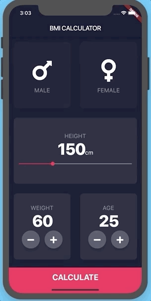

# BMI Calculator 🏋️‍♀️

A beautiful and functional Body Mass Index (BMI) calculator application built with Flutter. This project focuses on learning custom design and advanced widget implementation.

## 📌 Project Description

The goal of this application is to demonstrate Flutter's capabilities in creating unique interfaces. Instead of standard Material components, it uses fully customized widgets that follow modern design trends.

## ✨ Key Features

  * **Custom UI:** Unique design using themes and HEX colors.
  * **Interactivity:** Sliders and buttons with custom feedback.
  * **Multi-page:** Smooth transitions between the input screen and the result screen.
  * **Responsiveness:** Correct display on various screen sizes.

## 🎓 Learning Outcomes

The following concepts were mastered during the development process:

  * **Themes & Branding:** Global application theme configuration.
  * **Navigation:** Using named routes (`Routes`) and `Navigator`.
  * **Advanced Widgets:** Working with `GestureDetector`, `Slider`, and creating custom reusable components.
  * **Dart Logic:** Using `Enums`, ternary operators, and understanding the difference between `const` and `final`.
  * **Composition vs Inheritance:** Creating UI through widget composition.

## 📷 Screenshot

| Result Screen |
| :---: |
|  |

## 🚀 How to Run

1.  Make sure you have the [Flutter SDK](https://docs.flutter.dev/get-started/install) installed.
2.  Clone the repository:
    ```bash
    git clone https://github.com/maratbeknyazov/bmi-calculator-flutter.git
    ```
3.  Navigate to the project folder:
    ```bash
    cd bmi-calculator-flutter
    ```
4.  Install dependencies:
    ```bash
    flutter pub get
    ```
5.  Run the application:
    ```bash
    flutter run
    ```